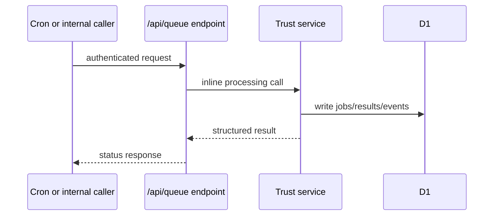

# Certification, Compliance, Observer, and Reputation — Current State

## Responsibility

This document owns the current trust pipeline: certification trials, compliance decisions, observer probes, reputation snapshots, W3C credential issuance, and revocation status.

## Product role

The trust pipeline helps users and downstream agents decide whether an agent is capable, healthy, policy-compliant, and currently reputable.

## Domain map

| Domain          | Current responsibility                                             | Representative storage/routes                                                                                        |
| --------------- | ------------------------------------------------------------------ | -------------------------------------------------------------------------------------------------------------------- |
| Certifier       | Trial jobs, grading, certificates, revocations, credential status. | `cert_jobs`, `trial_results`, `certificates`, `cert_revocations`, `/api/queue/cert-trial`, `/credentials/status/:id` |
| Compliance      | Policy evaluation, violations, scan runs, HMAC-signed decisions.   | `compliance_*`, `/a2a` policy actions, `/api/compliance/scan`                                                        |
| Observer        | Probe runs, telemetry events, reputation snapshots, alert inputs.  | `probe_runs`, `telemetry_events`, `reputation_snapshots`, `/api/queue/probe-run`                                     |
| Trust framework | Cross-registry scores and graph-style trust metadata.              | `federation_trust_scores`, `cross_registry_scores`, `trust_framework_meta`, `/api/trust/*`                           |
| Auditor         | Payment and receipt auditing used by compliance and billing flows. | `audit_*`, `/a2a` audit actions                                                                                      |

## Inline processing model

Cert trials, probe runs, and webhook deliveries are processed inline rather than through Cloudflare Queues. The `/api/queue/*` routes remain authenticated HTTP entry points for internal callers and cron-style workflows.

## Credentials and keys

- Certificate issuance uses node-held key material and Web Crypto APIs.
- Operators using Cloudflare Secrets Store bindings resolve node secrets directly from the binding.
- Self-hosted nodes can initialize logical node secrets into KV through `/admin/keys` (see [`secret-provisioning.md`](secret-provisioning.md)).
- Release checks for secret provisioning live in [`secret-provisioning.md`](secret-provisioning.md).

## Operator surfaces

Admin pages expose certifier, compliance, observer, auditor, trust, and related monitoring views. They are authenticated surfaces and should not be confused with the public registry.

## Known gaps

Stricter API-key scope enforcement, broader OpenAPI coverage, and end-to-end admin validation are open work.
