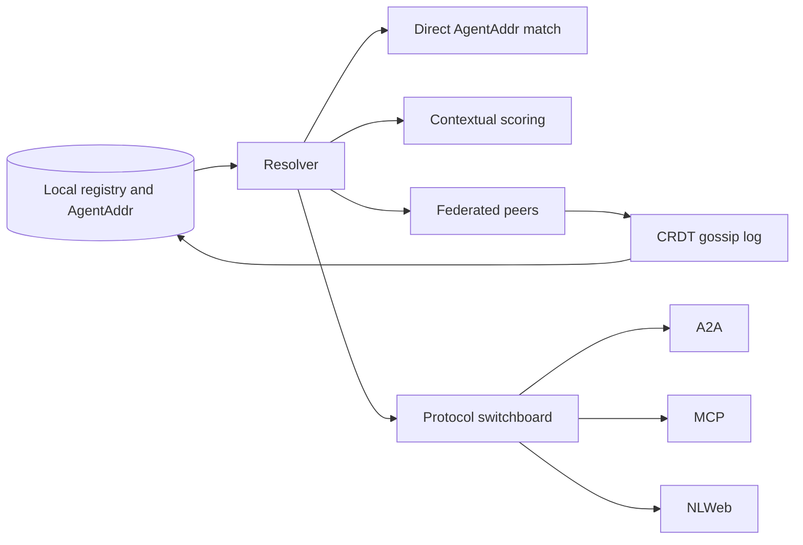

# Federation, Resolution, Lean Index, and Switchboard — Current State

## Responsibility

This document owns cross-node discovery, Lean Index/AgentAddr resolution, federation v2 gossip, quilt routing, SafeSearch-adjacent resolution behavior, and switchboard protocol adaptation.

## Current product role

Federation and resolution let one node find agents beyond its own local registry, sync trusted peers, and adapt agents across A2A, MCP, and NLWeb-style protocols.

## Current surfaces

| Surface                                                        | Responsibility                                    |
| -------------------------------------------------------------- | ------------------------------------------------- |
| `/resolve/:agent_id`                                           | Lean Index lookup by agent ID.                    |
| `POST /resolve`                                                | Adaptive resolver with strategy selection.        |
| `/.well-known/nanda-index`                                     | Public AgentAddr index.                           |
| `/.well-known/nanda-index/diff`                                | Index delta surface.                              |
| `/federation/peers`                                            | Peer listing.                                     |
| `/federation/gossip`                                           | CRDT gossip intake.                               |
| `/federation/status`                                           | Federation health/status.                         |
| `/federation/agents`                                           | Federated agent listing.                          |
| `/api/cron/gossip-push` and `/api/cron/external-registry-sync` | Scheduled sync/push paths.                        |
| `/api/switchboard/*`                                           | Protocol discovery, adapters, resync, and export. |

## Current flow

## Data responsibilities

- `agent_addrs`, `resolution_log`, and `protocol_adapters` support resolution and protocol adaptation.
- `federation_peers`, `gossip_log`, and `quilt_routes` support federation v2 and quilt-style routing.
- Historical docs describe future `agents` to `agent_addrs` consolidation; current behavior still uses both surfaces.

## Boundaries and risks

- Inbound gossip authenticates with the enrolled peer Ed25519 SPKI (`federation_peers.public_key_spki`). Unknown node → 401, unenrolled key → 403, bad/missing signature → 401. Outbound gossip is signed and does not send the shared admin bearer.
- The shared `NANDA_FEDERATION_ADMIN_KEY` remains enrollment-only (`POST /federation/peers`, `/federation/join`, admin surfaces).
- Federated AgentAddr merge/resigning and single-source AgentAddr migration are not complete current-state behavior.
