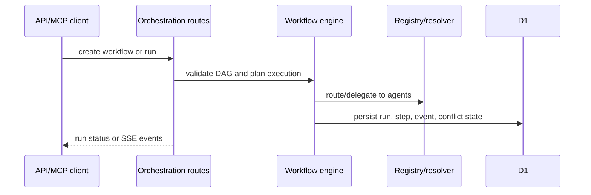

# Orchestration — Current State

## Responsibility

This document owns multi-agent workflow orchestration: workflow definitions, steps, runs, routing, delegation, events, patterns, and conflict resolution.

## Product role

Orchestration turns registered and resolvable agents into coordinated workflows. It gives operators and API clients a way to define DAG-like workflows, route tasks, delegate sub-work, stream run status, and handle conflicts.

## Current surfaces

| Surface                                 | Responsibility                                 |
| --------------------------------------- | ---------------------------------------------- |
| `/api/orchestration`                    | List and create workflows.                     |
| `/api/orchestration/:id`                | Read/update/delete a workflow.                 |
| `/api/orchestration/:id/runs`           | Start a workflow run.                          |
| `/api/orchestration/runs/:runId`        | Read run status.                               |
| `/api/orchestration/runs/:runId/events` | SSE event stream.                              |
| `/api/orchestration/route`              | Intelligent agent routing.                     |
| `/api/orchestration/delegate`           | Sub-agent delegation.                          |
| `/api/orchestration/conflicts`          | Conflict listing and resolution.               |
| `/api/orchestration/patterns`           | Pattern registry.                              |
| `/admin/orchestration`                  | Operator-facing orchestration view.            |
| MCP tools                               | `nanda_create_workflow`, `nanda_run_workflow`. |

## Current flow

## Data responsibilities

- `workflows`, `workflow_steps`, `workflow_runs`, and `workflow_step_runs` hold definitions and execution state.
- `orchestrator_patterns`, `delegation_tasks`, `routing_decisions`, `workflow_events`, and `conflict_resolutions` support advanced workflow behavior.

## Boundaries

- Orchestration depends on registry/resolver state but does not own registry data quality.
- Auth lanes and API-key scopes are contract concerns documented in [`MCP_API_CONTRACTS.md`](MCP_API_CONTRACTS.md).
- Browser E2E coverage for orchestration journeys is open work; unit-level coverage is in `tests/`.
