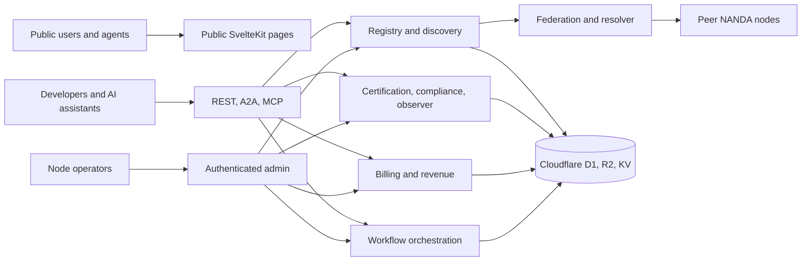

# Homeport — Product Architecture

## Overview

Homeport is a self-hostable NANDA node: a SvelteKit 2 / Svelte 5
application deployed on Cloudflare Workers, backed by D1, R2, and
KV. One node owns all of its own infrastructure — there is no
shared runtime between operators. Nodes discover and talk to each
other through the federation protocol.

This document is the source-of-truth index. Deeper facts live in
focused sub-docs so this one stays short.

| Concern                                                       | Owner                                                                                |
| ------------------------------------------------------------- | ------------------------------------------------------------------------------------ |
| Registry, AgentFacts, discovery, SafeSearch, AgentAddr        | [`REGISTRY_DISCOVERY.md`](REGISTRY_DISCOVERY.md)                                     |
| Certification, compliance, observer, reputation, credentials  | [`CERTIFICATION_COMPLIANCE.md`](CERTIFICATION_COMPLIANCE.md)                         |
| Federation, resolver, Lean Index, protocol switchboard        | [`FEDERATION_RESOLUTION.md`](FEDERATION_RESOLUTION.md)                               |
| Workflow orchestration, routing, delegation, events           | [`ORCHESTRATION.md`](ORCHESTRATION.md)                                               |
| Billing, UCP checkout, subscriptions, invoices, revenue share | [`BILLING_REVENUE.md`](BILLING_REVENUE.md)                                           |
| REST, A2A, MCP, OpenAPI, auth lanes                           | [`MCP_API_CONTRACTS.md`](MCP_API_CONTRACTS.md)                                       |
| Install, bindings, secrets, deploy                            | [`OPERATIONS.md`](OPERATIONS.md), [`secret-provisioning.md`](secret-provisioning.md) |
| Test strategy                                                 | [`TESTING.md`](TESTING.md)                                                           |

## Service domains

Every node runs the same set of service domains behind a single
HTTP entry point:

- **Registry** — agents, agent_facts, versions; `/register`,
  `/lookup`, `/search`, `/list`, `/stats`, `/agentfacts`.
- **Certifier** — automated trials, Wilson-CI grading, W3C
  Verifiable Credential issuance, Ed25519 signatures.
- **Compliance** — policy evaluation, violation reporting,
  automated scanning.
- **Observer** — scheduled probes, latency measurement, weighted
  reputation scoring.
- **Auditor** — HMAC-verified transaction intents, settlement
  matching, double-entry wallets.
- **Trust framework** — cross-registry scores, trust graph.
- **Webhooks** — HMAC-SHA256 signed delivery of node events.
- **Federation** — CRDT gossip, peer management, quilt routing.
- **Lean Index** — Ed25519-signed AgentAddr records; DNS for
  agents at `/.well-known/nanda-index` and `/resolve`.
- **Switchboard** — protocol adapters (A2A, MCP, NLWeb).
- **Billing / payments** — UCP checkout sessions, invoices,
  subscriptions, revenue sharing, multi-currency wallets.
- **Orchestration** — DAG-based multi-agent workflows with
  patterns, routing, delegation, and SSE run events.

## System shape



## Architecture principles

- **Self-contained.** Every node owns all its infrastructure — no
  shared databases, no multi-tenant routing.
- **Federated.** Peer nodes exchange gossip; agent registrations
  propagate automatically.
- **Inline processing.** Certification trials, probe runs, and
  webhook delivery run inline through service calls — no external
  queue infrastructure required.
- **Cryptographically sovereign.** Each node has its own Ed25519
  keypair; every issued credential and AgentAddr record is signed
  by the node and verifiable through
  `/.well-known/keys/[version]`.
- **Edge-native.** One `wrangler deploy` puts the whole node on
  Cloudflare's edge.

## Delegation grants and PUH proofs

Homeport ships a production delegation-grant module with a
human-anchored proof-of-unique-human (PUH) envelope. This is the
same code path used by the `delegated_admission` NANDA Town skill.

### Grant chain schema

Migration
`drizzle/migrations/0004_delegation_grant_chain_columns.sql` extends
the `delegation_tasks` table with five columns:

- `granted_scope` — JSON scope set inherited from the parent. A
  child grant's scope MUST be a subset of its parent's.
- `expires_at` — UNIX seconds. A child grant's expiry MUST NOT
  exceed its parent's.
- `granted_by_proof_hash` — SHA-256 hex of the canonical PUH
  envelope produced by `verifyPuhProof`.
- `parent_delegation_id` — nullable pointer forming the grant
  chain.
- `revocable` — immutable across a chain: a child cannot flip a
  revocable parent to non-revocable.

### A2A actions and authorization

Dispatched by the JSON-RPC handler at `POST /a2a`
(`src/routes/a2a/+server.ts`) against
`src/lib/server/delegation-grants.ts`:

- `delegation.grant` — issues a new grant. Requires an
  authenticated caller whose identity matches `grantedByDid`, or
  whose API key carries `operator` / `admin` scope.
- `delegation.revoke` — revokes a grant and cascades to every
  descendant reachable via `parent_delegation_id` (up to 32 hops).
  Caller must be the delegator or hold `operator` / `admin`.
- `delegation.check` — returns
  `{valid, revoked, revokedAt?, expired, expiresAt?, credentialSubject:{...}}`.
  Caller must be the delegator, the delegate, or hold `operator` /
  `admin`.

Unauthenticated calls receive JSON-RPC error `-32001`.

### Canonical proof envelope

`verifyPuhProof` requires the caller to supply a proof envelope
whose SHA-256 canonical serialization matches the wire
`grantedByProofHash`. The canonical form is:

```
{ principalPk, deviceDid, requestId, grantee, scope: { toolNames },
  expiresAt, parentDelegationId, revocable, issuedAt }
```

`toolNames` is trimmed, deduplicated of empties, and sorted.
Freshness window on `proof.boundAt` and `proof.issuedAt`
(milliseconds) is 5 minutes with 30 s clock-skew allowance.
`proof.signature` is Ed25519-verified against `proof.principalPk`.

### Ancestor cascade

`checkDelegation` walks `parent_delegation_id` upward. If any
ancestor has been revoked, or any ancestor's `expires_at` has
passed, the descendant reports `valid: false` (with `revoked` or
`expired` set, and `expiresAt` lowered to the ancestor's). This
closes the confused-deputy path where a child otherwise outlives
its parent's authorization.

## Product boundaries

Homeport owns the NANDA node app, its public and admin web
surfaces, all worker routes, protocol endpoints, database schema,
and deploy scripts. It does **not** own upstream NANDA
specifications, Cloudflare account state, or the separate NANDA
SDK package.

## Security and privacy

- Secrets are Cloudflare Secrets Store bindings or KV-managed node
  secrets — never checked-in values. See
  [`secret-provisioning.md`](secret-provisioning.md).
- Developer API keys and browser-session auth are separate lanes;
  admin-only paths reject API-key auth where the product requires
  it.
- Public discovery data is distinct from admin settings, private
  keys, and operational secrets.

## Testing

Vitest is the primary test framework, running inside
`@cloudflare/vitest-pool-workers` (miniflare). See
[`TESTING.md`](TESTING.md) for the strategy and the current
coverage matrix.
